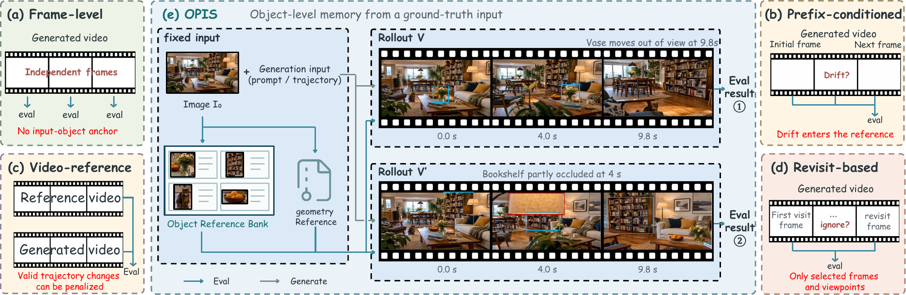
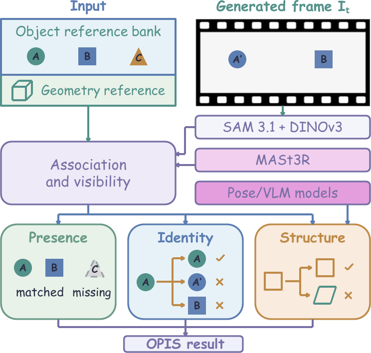
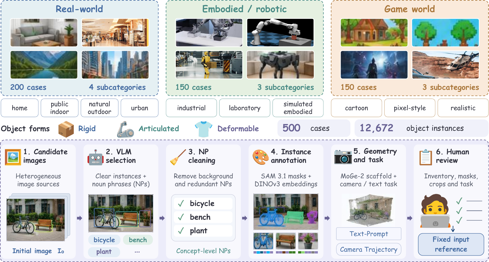

<div align="center">

# OPIS

### An Input-Grounded Benchmark for Multi-Object Memory in Video World Models

Evaluate whether a generated world preserves the **presence**, **identity**, and **structure** of the objects established by its initial observation.

[](https://arxiv.org/abs/2609.35052)
[](https://huggingface.co/datasets/Kirito-Lab/OPIS-datase)
[](https://github.com/SSStarain/OPIS)

[Overview](#overview) · [Dataset](#dataset) · [Full Evaluation](#full-opis-evaluation) · [Citation](#citation)

</div>

<p align="center">
  
</p>

## Overview

Video world models can produce plausible scenes while quietly forgetting the particular objects that made the input world unique. Existing frame-level, prefix-conditioned, video-reference, and revisit-based protocols do not fully isolate this failure mode.

**OPIS** anchors evaluation to a fixed object reference bank built only from the initial observation. The same reference can evaluate different valid rollouts without requiring a single ground-truth future video. One-to-one association and explicit visibility reasoning distinguish genuine memory failures from valid camera motion, occlusion, articulation, or deformation.

| Benchmark scale | Coverage |
|---|---|
| **500** cases | Real-world, embodied/robotic, and game-world scenes |
| **12,672** object instances | 8,432 rigid, 2,046 articulated, and 2,194 deformable |
| **10** subcategories | Home, public indoor, natural outdoor, urban, industrial, laboratory, simulated embodied, cartoon, pixel-style, and realistic |
| **8** evaluated models | Image-to-video and camera-conditioned world models |

### What OPIS measures

| Component | Question | Evaluation signal |
|---|---|---|
| **Presence (P)** | Are all observable input objects still accounted for, without confirmed extras? | One-to-one object association with visibility-aware missing/extra detection |
| **Identity (I)** | Does each observed object remain the same instance as in the input? | Input-to-frame appearance fidelity with strict per-object acceptance |
| **Structure (S)** | Is the object's geometry or structural organization preserved? | Static input-grounded geometry or dynamic pose/VLM evidence, selected by object kinematics |

The final score uses `OPIS = 100 × (0.2 P + 0.4 I + 0.4 S)`. Structure is coverage-adjusted, and evidence coverage is reported separately.

<p align="center">
  
</p>

## Dataset

The OPIS dataset contains 500 human-verified cases across three domains. Each case includes an initial image, a generation instruction or camera task, and evaluator-side object annotations grounded in that input.

<p align="center">
  
</p>

The complete dataset is hosted at [Kirito-Lab/OPIS-datase on Hugging Face](https://huggingface.co/datasets/Kirito-Lab/OPIS-datase). Download it from the repository page, or use the Hugging Face CLI:

```bash
python -m pip install --upgrade huggingface_hub
hf download Kirito-Lab/OPIS-datase \
  --repo-type dataset \
  --local-dir dataset
```

The download preserves the case-directory structure expected by `run-benchmark_v3`. Each case already contains its initial image, generation instructions, and processed evaluator reference, so no additional reference-building step is required.

The data construction pipeline combines VLM-assisted candidate selection, noun-phrase cleaning, SAM 3.1 instance masks, DINOv3 appearance embeddings, MoGe-2 geometry, task construction, and human review. The fixed reference is never updated with generated content.

## Full OPIS Evaluation

The production pipeline uses the fixed reference supplied with each dataset case, observes a generated video, prepares input-grounded geometry, and computes the OPIS components.

### Requirements

- Linux or WSL2
- Python 3.12
- NVIDIA GPU with a compatible CUDA driver
- FFmpeg and FFprobe
- PyTorch 2.7+ and CUDA 12.6+ for SAM 3.1

Python 3.13 is not recommended for this stack because SAM 3.1 currently requires NumPy below 2.

Install CUDA-enabled PyTorch using the [official PyTorch selector](https://pytorch.org/get-started/locally/). For a CUDA 12.8-compatible driver:

```bash
python -m pip install torch==2.10.0 torchvision \
  --index-url https://download.pytorch.org/whl/cu128
python -m pip install -e "./multiMemBench[vision,moge2,mast3r,sam3]"

git clone --recursive https://github.com/naver/mast3r.git models/mast3r
python -m pip install \
  -r models/mast3r/requirements.txt \
  -r models/mast3r/dust3r/requirements.txt

export PYTHONPATH="$PWD/models/mast3r:$PWD/models/mast3r/dust3r:${PYTHONPATH:-}"
python -m pip check
```

Download the geometry and matching checkpoints:

```bash
python -m pip install --upgrade huggingface_hub
hf download Ruicheng/moge-2-vitl model.pt --local-dir models/moge-2-vitl
hf download naver/MASt3R_ViTLarge_BaseDecoder_512_catmlpdpt_metric \
  --local-dir models/mast3r-hf
```

Request access on the official [SAM 3 model page](https://huggingface.co/facebook/sam3), authenticate, and download its checkpoint:

```bash
hf auth login
hf download facebook/sam3 sam3.pt --local-dir models/sam3
```

### Configuration

Create `vision_config.json` in the repository root:

```json
{
  "device": "cuda",
  "strict_models": true,
  "sam3_checkpoint_path": "./models/sam3/sam3.pt",
  "embedding_backend": "colorhist",
  "video_segmentation_mode": "framewise"
}
```

Create `v3_config.json` in the repository root:

```json
{
  "geometry_mode": "input_grounded",
  "monocular_model_id": "./models/moge-2-vitl/model.pt",
  "matcher_model_id": "./models/mast3r-hf",
  "monocular_device": "cuda",
  "matcher_device": "cuda",
  "matcher": "mast3r",
  "allow_opencv_fallback": false
}
```

MoGe expects a checkpoint **file**, while the MASt3R Hugging Face download is a model **directory**. Relative paths are resolved from the configuration file.

### Evaluate a video

Each downloaded dataset case has already been processed into an evaluator-ready input reference. A case directory contains the initial image (`raw.jpg`), object annotation (`reference_scene.json`), and generation instructions such as `text_prompt.txt` or `conditions.json`. **You do not need to run `build-reference` for OPIS dataset cases.**

Point `--scene-dir` to a case folder and `run-benchmark_v3` will resolve these assets automatically, generate or import the video, and run evaluation in one workflow.

### Evaluate an existing video

```bash
multimem-eval run-benchmark_v3 \
  --scene-dir dataset/final/<subcategory>/<case_id> \
  --video /path/to/generated.mp4 \
  --model existing-video \
  --vision-config vision_config.json \
  --v3-config v3_config.json \
  --output-root runs/workflow \
  --no-structure
```

`--model` labels the video's source; it does not download a generation model.

### Generate through an API and evaluate

The API workflow supports `fal`, `openrouter`, and `ark`. Export the provider, credentials, model ID, and a public HTTPS URL for the case input image before running. `VIDEO_API_KEY` may be replaced by the provider-specific `FAL_KEY`, `OPENROUTER_API_KEY`, or `ARK_API_KEY`.

```bash
export VIDEO_BACKEND=api
export VIDEO_API_PROVIDER=fal                  # fal | openrouter | ark
export VIDEO_API_KEY="<provider-api-key>"
export VIDEO_MODEL="<provider-model-id>"
export VIDEO_IMAGE_URL="https://.../raw.jpg"

multimem-eval run-benchmark_v3 \
  --scene-dir dataset/final/<subcategory>/<case_id> \
  --vision-config vision_config.json \
  --v3-config v3_config.json \
  --output-root runs/workflow \
  --no-structure
```

For a compatible OpenAI-style video endpoint, also export `VIDEO_BASE_URL`. Instead of `VIDEO_IMAGE_URL`, the workflow can publish the local input through configured S3/R2 storage; see `multimem-eval run-benchmark_v3 --help` for the corresponding options.

### Generate with a local deployment and evaluate

Use `VIDEO_BACKEND=local` for a configured local image-to-video model, or `VIDEO_BACKEND=local-wm` for a locally deployed camera-conditioned world model. Export the model ID and any model-specific checkpoint/runtime variables required by that deployment.

```bash
# Local image-to-video example
export VIDEO_BACKEND=local
export VIDEO_MODEL="wan2.2/i2v-a14b"

multimem-eval run-benchmark_v3 \
  --scene-dir dataset/final/<subcategory>/<case_id> \
  --vision-config vision_config.json \
  --v3-config v3_config.json \
  --output-root runs/workflow \
  --no-structure
```

```bash
# Local camera-conditioned world-model example
export VIDEO_BACKEND=local-wm
export VIDEO_MODEL="sana-wm"

multimem-eval run-benchmark_v3 \
  --scene-dir dataset/final/<subcategory>/<case_id> \
  --vision-config vision_config.json \
  --v3-config v3_config.json \
  --output-root runs/workflow \
  --no-structure
```

The local model must already be deployed and configured. Supported local profiles are defined in `multiMemBench/configs/video_models.json`.

In all examples, `--no-structure` runs Presence and Identity only. For the complete P/I/S evaluation, install `./multiMemBench[pose]`, export `VLM_BASE_URL`, `VLM_MODEL`, and `VLM_API_KEY`, then omit `--no-structure`.

<details>
<summary><b>Optional models and generation backends</b></summary>

### Appearance embeddings

The configuration above uses color histograms and requires no appearance checkpoint. For paper-aligned DINOv3 appearance features, obtain weights from the [official DINOv3 repository](https://github.com/facebookresearch/dinov3), set `embedding_backend` to `dinov3`, configure `dinov3_repo_or_dir`, `dinov3_model_name`, and `dinov3_weights_path`, then rebuild the reference with the same configuration.

### SAM 3.1 tracking

For multiplex video segmentation, obtain `facebook/sam3.1/sam3.1_multiplex.pt`, point `sam3_checkpoint_path` to that file, and use `video_segmentation_mode: "tracking"`. Build the input-image reference separately with the framewise SAM configuration.

### V2 geometry

Install `python -m pip install -e "./multiMemBench[vggt]"`. The default `facebook/VGGT-1B` model downloads on first use. VGGT-Omega requires the `vggt-omega` extra and an explicit checkpoint.

</details>

## Repository Layout

```text
OPIS/
├── assets/                   # README figures
├── multiMemBench/
│   ├── multimem_bench/       # Evaluator, vision, geometry, and workflows
│   ├── examples/             # Example artifacts and configurations
│   └── pyproject.toml
├── run_model/                # Video-generation adapters
├── run_v3.sh                 # V3 workflow entry point
└── README.md
```

Run `multimem-eval <command> --help` for the complete command-line interface.


## Citation

If OPIS is useful in your research, please cite the paper:

```bibtex
@misc{wang2026opisinputgroundedbenchmarkmultiobject,
      title={OPIS: An Input-Grounded Benchmark for Multi-Object Memory in Video World Models}, 
      author={Hao Wang and Tao Yu and Liuzhou Zhang and HeXin Wang and Haopeng Jin and Yuxuan Zhou and Xinming Wang and Hongzhu Yi and Xinye Li and Yuanlei Wang and Ping Nie and Yan Huang and Yuxuan Zhang and Pengfei Zhou and Yanyan Zou and Wei Yang},
      year={2026},
      eprint={2609.35052},
      archivePrefix={arXiv},
      primaryClass={cs.CV},
      url={https://arxiv.org/abs/2609.35052}, 
}
```

## Acknowledgements

OPIS builds on open research and tooling including SAM 3.1, DINOv3, MoGe-2, MASt3R, ViTPose, and ViTPose++. Please also follow the licenses and citation requirements of the corresponding upstream projects and model checkpoints.
